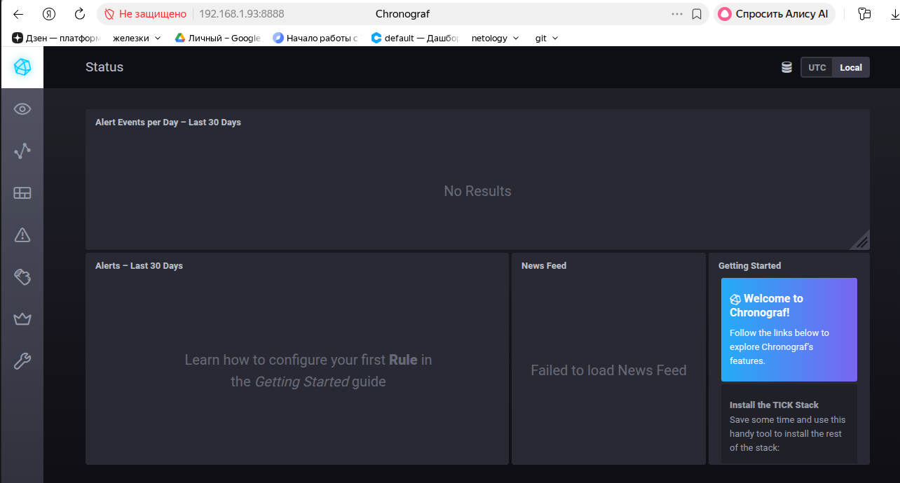
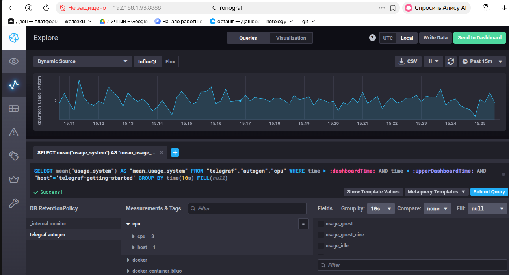
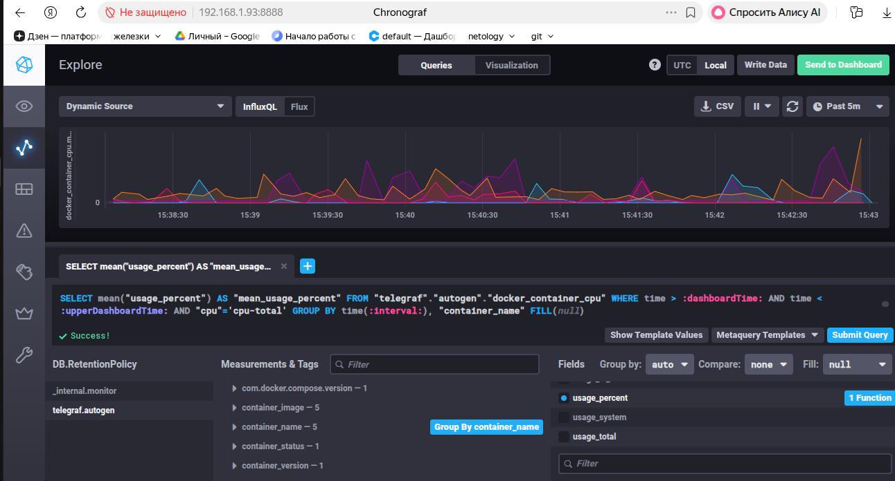

# Домашнее задание к занятию "13.Системы мониторинга"

### Обязательные задания

1. Вас пригласили настроить мониторинг на проект. На онбординге вам рассказали, что проект представляет из себя платформу для вычислений с выдачей текстовых отчетов, которые сохраняются на диск. Взаимодействие с платформой осуществляется по протоколу http. Также вам отметили, что вычисления загружают ЦПУ. Какой минимальный набор метрик вы выведите в мониторинг и почему?

**Ответ**

- CPU LA (load average) — вычисления грузят процессор, надо видеть нагрузку и тренд
- RAM/swap — вычисления могут съедать память, swap = сигнал проблем
- IOPS — запись отчётов на диск, смотрим интенсивность дисковых операций
- FS (свободное место на диске) — отчёты копятся, диск может переполниться
- inodes — много мелких файлов-отчётов могут исчерпать inode
- Количество HTTP-запросов в единицу времени (нагрузка на платформу).
- Время выполнения HTTP-запроса (от получения запроса до выдачи готового отчета).
- Количество HTTP-ответов с кодами 4xx/5xx или внутренних ошибок генерации/сохранения отчета.

2. Менеджер продукта посмотрев на ваши метрики сказал, что ему непонятно что такое RAM/inodes/CPUla. Также он сказал, что хочет понимать, насколько мы выполняем свои обязанности перед клиентами и какое качество обслуживания. Что вы можете ему предложить?

**Ответ**

Для менеджера делаем отдельный дашборд с метриками качества обслуживания связка из SLI / SLO / SLA 
SLI (Service Level Indicator) — индикатор качества обслуживания. Конкретная измеряемая величина того, как мы обслуживаем клиентов прямо сейчас.
SLO (Service Level Objective) — целевой уровень качества обслуживания. Целевое значение или диапазон, к которому мы обязуемся стремиться. 
SLA (Service Level Agreement) — соглашение об уровне обслуживания. Явный или неявный контракт с внешними пользователями, включающий последствия невыполнения SLO.

3. Вашей DevOps команде в этом году не выделили финансирование на построение системы сбора логов. Разработчики в свою очередь хотят видеть все ошибки, которые выдают их приложения. Какое решение вы можете предпринять в этой ситуации, чтобы разработчики получали ошибки приложения?

**Ответ**

Вместо дорогой и сложной в обслуживании системы сбора логов предложить разработчикам внедрить Sentry (или аналогичный «перехватчик ошибок»). Это узкоспециализированный инструмент, который закрывает именно их потребность — видеть ошибки своего кода в реальном времени с полным контекстом, и при этом обходится без затрат на тяжёлую log-инфраструктуру.

4. Вы, как опытный SRE, сделали мониторинг, куда вывели отображения выполнения SLA=99% по http кодам ответов. Вычисляете этот параметр по следующей формуле: summ_2xx_requests/summ_all_requests. Данный параметр не поднимается выше 70%, но при этом в вашей системе нет кодов ответа 5xx и 4xx. Где у вас ошибка?

**Ответ**

В числителе формулы учтены только 2xx-коды, но не учтены 3xx-коды (редиректы).
вот исправленный вариант
```
SLI = (summ_2xx_requests + summ_3xx_requests) / summ_all_requests
```
5. Опишите основные плюсы и минусы pull и push систем мониторинга.

**Ответ**

Push-модель — агенты (рабочие машины, с которых собираем мониторинг) сами отправляют данные в систему мониторинга через вспомогательные службы или программы (обычно по UDP).
Плюсы:
- Упрощение репликации данных — метрики легко отправлять в разные системы мониторинга или в их резервные копии (агент может слать данные в несколько мест сразу).
- Более гибкая настройка отправки пакетов данных с метриками — можно управлять частотой, форматом и адресатами отправки на стороне агента.
- Производительность — передача идёт по UDP, это менее затратный способ передачи данных, из-за чего может возрасти производительность сбора метрик.
Минусы:
- Сложнее контролировать подлинность данных — система принимает всё, что ей присылают агенты.
- Нет единого прокси с TLS до всех агентов — сложнее организовать централизованное защищённое соединение, так как агенты сами инициируют отправку.
- Сложнее отладка получения данных — если метрика не пришла, нужно разбираться на стороне агента, отправлял ли он её вообще.

Pull-модель — система мониторинга сама последовательно или параллельно собирает накопленную информацию с агентов из вспомогательных служб.
Плюсы:
- Легче контролировать подлинность данных — система сама опрашивает только известные ей агенты и контролирует, откуда пришли данные.
- Можно настроить единый proxy server до всех агентов с TLS — централизованная точка доступа и защиты соединений.
- Упрощённая отладка получения данных с агентов — система сама инициирует запрос, поэтому всегда видно, удался ли сбор и что вернул агент.
Минусы:
- Сложнее репликация данных в разные системы мониторинга или резервные копии — каждая система должна сама опрашивать агентов.
- Менее гибкая настройка отправки — инициатива на стороне сервера мониторинга, агент не управляет тем, куда и когда уходят метрики.
- Более затратный сбор — в отличие от «дешёвого» UDP в push-модели, здесь системе нужно самой устанавливать соединения и забирать данные с каждого агента, что при большом числе узлов повышает нагрузку.

6. Какие из ниже перечисленных систем относятся к push модели, а какие к pull? А может есть гибридные?

Prometheus
TICK
Zabbix
VictoriaMetrics
Nagios

**Ответ**

Prometheus pull
TICK push
Zabbix гибридная
VictoriaMetrics гибридная
Nagios pull (с возможностью гибрида)

7. Склонируйте себе репозиторий и запустите TICK-стэк, используя технологии docker и docker-compose.
В виде решения на это упражнение приведите скриншот веб-интерфейса ПО chronograf (http://localhost:8888).



8. Перейдите в веб-интерфейс Chronograf (http://localhost:8888) и откройте вкладку Data explorer.

 - Нажмите на кнопку Add a query
 - Изучите вывод интерфейса и выберите БД telegraf.autogen
 - В measurments выберите cpu->host->telegraf-getting-started, а в fields выберите usage_system. Внизу появится график утилизации cpu.
 - Вверху вы можете увидеть запрос, аналогичный SQL-синтаксису. Поэкспериментируйте с запросом, попробуйте изменить группировку и интервал наблюдений.
Для выполнения задания приведите скриншот с отображением метрик утилизации cpu из веб-интерфейса.



9. Изучите список telegraf inputs. Добавьте в конфигурацию telegraf следующий плагин - docker
После настройке перезапустите telegraf, обновите веб интерфейс и приведите скриншотом список measurments в веб-интерфейсе базы telegraf.autogen . Там должны появиться метрики, связанные с docker.



